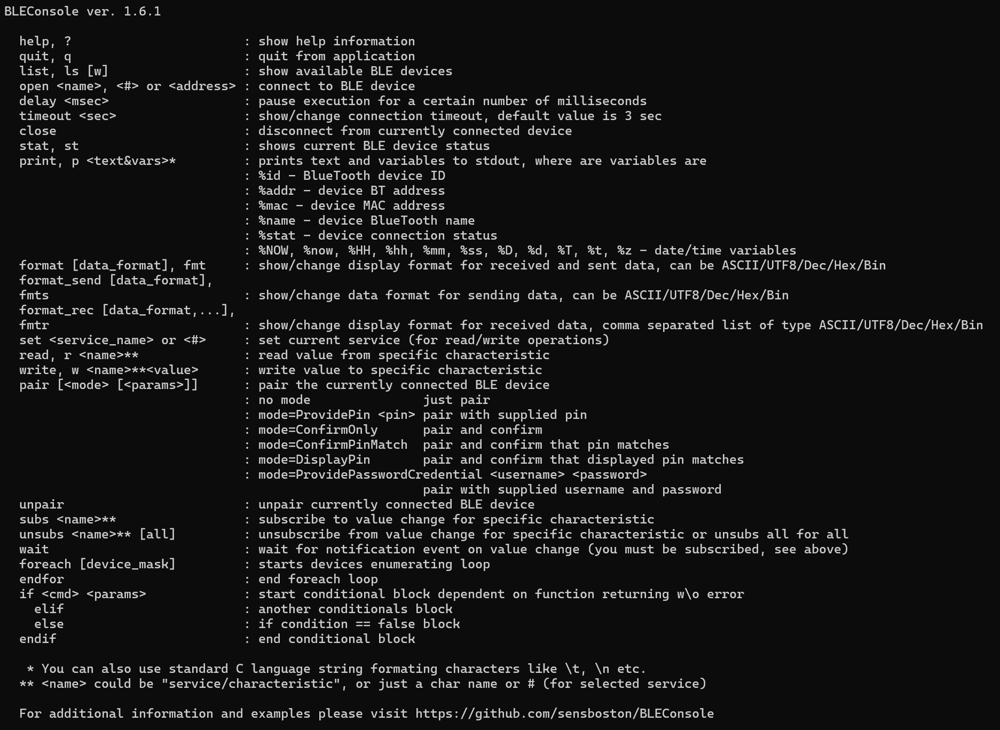

# BLEConsole

Windows command-line tool for interacting with Bluetooth LE devices



This is a fork of https://github.com/sensboston/BLEConsole

## Version 2.1 - Enhanced Pairing and Usability

**New in v2.1:**
- **Smart Auto-Pairing**: Automatic pairing when connecting with `open device [pin]`
- **Interactive PIN Input**: Support for devices that display random PIN (DisplayOnly IO capability)
- **Endianness Control**: New `endian` command for byte order (Little/Big Endian)
- **Improved `pair` command**: Direct PIN input (`pair 123456`), all pairing modes supported
- **Improved `unsubs` command**: Unsubscribe from specific characteristic or all at once
- **Pairing Status Display**: `stat` command shows pairing information
- **Better Error Messages**: Improved English and consistency across all commands

**Previous in v2.0:**
- Complete refactoring with Command Pattern architecture
- Descriptor support (read/write GATT descriptors)
- MTU information display
- Fast writes (WriteWithoutResponse via `write -nr`)
- Batch read operations (`read-all`)
- Device Information Service helper (`device-info`)
- Enhanced characteristic properties display

See [CHANGELOG.md](./BLEConsole/CHANGELOG.md) for complete details.

### Requirements

Windows 10, BT 4.0 adapter

### Console Commands

#### General Commands
- **help**, **?**: show help information
- **quit**, **q**: quit from application
- **list**, **ls** `[w]`: show available BLE devices (`w` for wide format with full IDs)
- **open** `<name|#|addr>` `[pin]`: connect to BLE device, with optional pairing PIN
- **close**: disconnect from currently connected device
- **stat**, **st**: show current BLE device status and pairing information
- **timeout** `<sec>`: show/change connection timeout (default: 3 sec)
- **delay** `<msec>`: pause execution for a certain number of milliseconds

#### Data Format Commands
- **format**, **fmt** `[format]`: show/change display format (ASCII/UTF8/Dec/Hex/Bin)
- **format_send**, **fmts** `[format]`: show/change send data format
- **format_rec**, **fmtr** `[format,...]`: show/change received data format (comma-separated list)
- **endian**, **bo** `[little|big]`: show/change byte order for read/write operations

#### GATT Operations
- **set** `<service_name|#>`: set current service for read/write operations
- **read**, **r** `<name>`**: read value from characteristic
- **read-all**, **ra** `[service]`: read all characteristics in a service
- **write**, **w** `[-nr]` `<name>`** `<value>`: write value to characteristic (`-nr` for WriteWithoutResponse)
- **subs** `<name>`**: subscribe to value change notifications
- **unsubs** `[<name>**|all]`: unsubscribe from specific characteristic or all (default: all)
- **wait**: wait for notification event

#### Descriptor Commands
- **desc** `<name>`: list all descriptors for a characteristic
- **read-desc**, **rd** `<char>/<desc>`: read descriptor value
- **write-desc**, **wd** `<char>/<desc>` `<value>`: write descriptor value

#### Device Information
- **mtu**: show current MTU size
- **device-info**, **di**, **info**: read Device Information Service

#### Pairing Commands
- **pair** `[<pin>]`: pair with optional PIN
- **pair** `mode=ProvidePin` `[pin]`: pair with PIN (interactive if not provided)
- **pair** `mode=ConfirmOnly`: pair with confirmation only
- **pair** `mode=DisplayPin`: pair when device displays PIN
- **pair** `mode=ConfirmPinMatch`: pair with PIN matching confirmation
- **unpair**: unpair currently connected device

#### Scripting Commands
- **print**, **p** `<text&vars>`*: print text and variables to stdout
  - `%id` - Bluetooth device ID
  - `%addr` - device BT address
  - `%mac` - device MAC address
  - `%name` - device Bluetooth name
  - `%stat` - device connection status
  - `%NOW, %now, %HH, %hh, %mm, %ss, %D, %d, %T, %t, %z` - date/time variables
- **foreach** `[device_mask]`: start device enumeration loop
- **endfor**: end foreach loop
- **if** `<cmd>` `<params>`: start conditional block
- **elif**: alternative condition block
- **else**: else block
- **endif**: end conditional block

_* You can use standard C escape characters like \t, \n etc._

_** `<name>` can be "service/characteristic", characteristic name, or # index_

### Examples

#### Connect with PIN pairing
```
BLE: open ESP32_Device 123456
Connecting to ESP32_Device. It is not paired.
Attempting to pair with PIN...
Pairing successful.
Found 3 services:
#00: GenericAccess
#01: GenericAttribute
#02: Custom Service
```

#### Interactive PIN pairing (device displays PIN)
```
BLE: open MyDevice
Connecting to MyDevice. It is not paired.
Attempting to pair...
Device is displaying a PIN. Enter the PIN shown on the device:
PIN: 847293
Pairing successful.
```

#### Subscribe and unsubscribe
```
BLE: set #2
Selected service Custom Service.
#00: NotifyChar   N
#01: WriteChar    W

BLE: subs #0
Subscribed to characteristic NotifyChar (notify)

BLE: unsubs #0
Unsubscribed from NotifyChar.

BLE: unsubs
Unsubscribed from 0 characteristic(s).
```

#### Change byte order for numeric data
```
BLE: endian big
Byte order set to Big Endian.

BLE: format hex
Current send data format: Hex
Current received data format: Hex

BLE: read #0
hex:    00 01 02 03
```

#### Batch script example
```
// Loop through all devices
foreach

    // Connect and if successful
    if open $

        // Read device name
        read #0/#0

        // Close connection
        close
    endif

endfor
```

### Notes

- Blank/empty lines in scripts are ignored
- Comments can be added with `//`
- Device list shows devices Windows has seen recently (not all may be currently available)
- You can use partial device names if unique (e.g., `open ESP` instead of `open ESP32_Device`)
